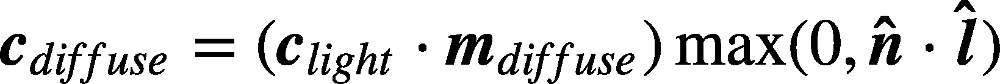
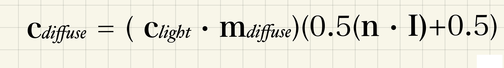

## 继 Unity Shader

### Lambert （兰伯特）光照模型

* 基础准备

``` ShaderLab
// Unity自带结构体
struct appdata_base 
{
    float4 vertex : POSITION;        //顶点坐标
    float3 normal : NORMAL;          //法线
    float4 texcoord : TEXCOORD0;     //第一纹理坐标
    UNITY_VERTEX_INPUT_INSTANCE_ID   //ID信息
};
struct appdata_tan
{
    float4 vertex : POSITION;        //顶点坐标
    float4 tangent : TANGENT;        //切线
    float3 normal : NORMAL;          //法线
    float4 texcoord : TEXCOORD0;     //第一纹理坐标
    UNITY_VERTEX_INPUT_INSTANCE_ID   //ID信息
};
struct appdata_full 
{
    float4 vertex : POSITION;        //顶点坐标
    float4 tangent : TANGENT;        //切线
    float3 normal : NORMAL;          //法线
    float4 texcoord : TEXCOORD0;     //第一纹理坐标
    float4 texcoord1 : TEXCOORD1;    //第二纹理坐标
    float4 texcoord2 : TEXCOORD2;    //第三纹理坐标
    float4 texcoord3 : TEXCOORD3;    //第四纹理坐标
    fixed4 color : COLOR;            //顶点颜色
    UNITY_VERTEX_INPUT_INSTANCE_ID   //ID信息
};

UnityObjectToWorldNormal()           //把物体的法线坐标，换算到世界坐标下
normalize()                          //把任何一个向量变成单位向量
dot()                                //点乘
max()                                //上文讲过
 
//以下要引用 #include "Lighting.cginc" 才能找到
 
_WorldSpaceLightPos0                 //世界坐标下的光线坐标
_LightColor0                         //光线的颜色
```

#### 兰伯特逐顶点算法

* **兰伯特逐顶点算法公式**：屏幕上对应点的颜色 = ( `光的颜色 * 物体的颜色` ) * `max(0, 该点的法向量 * 该点的光照方向)`



* 注意事项：在计算 `n * l` 时，注意：该点的法向量（往往直接获取的是物体本地坐标），该点的光照方向（往往获取的是世界坐标）是不能直接相乘的，需要把他们都换算到一个坐标系。这里换算到世界坐标下。

``` ShaderLab
Shader "Custom/LambertByVertex"
{
    Properties
    {
        _Color("Color", Color) = (1, 1, 1, 1)
        _MainTex("InputTex", 2D) = "white" {}
    }

    SubShader
    {
        // Blend One Zero
        
        Pass
        {
            // Name "LambertByVertex"

            CGPROGRAM
            #pragma vertex vert
            #pragma fragment frag
 
            #include "UnityCG.cginc"
            
            //新的引用
            #include "Lighting.cginc"
 
            //返回结构体        //引用结构体
            appdata_full vert (appdata_full v)
            {    
                //模型顶点坐标转屏幕坐标
                v.vertex = UnityObjectToClipPos(v.vertex);
                
                //获取法线坐标并转换成世界坐标下的法线坐标
                float3 worldNormal = UnityObjectToWorldNormal(v.normal);
 
                 //世界坐标下的光线坐标  //单位化坐标   //获取世界坐标下的光线坐标
                float3 worldLight = normalize(_WorldSpaceLightPos0.xyz);
                
                 //上面的公式
                float3 diffuse = _LightColor0.rgb * v.color.rgb * max(0, dot(worldNormal, worldLight));
 
                //算出的值给颜色
                v.color = float4(diffuse, 1);
                
                return v;
            }
 
            float4 frag (appdata_full v) : SV_Target
            {    
                //输出颜色    
                return v.color;
            }
            ENDCG
        }
    }
}
```

#### 兰伯特逐像素算法

* 像素和顶点算法的区别：
  1. 从写法角度来看：顶点算法是在顶点着色器中写的，像素算法是在片元着色器中写的。
  2. 从原理角度来说：因为顶点是初始值，经过一系列计算后，数据就会和我们想要的有些偏差。

``` ShaderLab
Shader "Custom/LambertByPixel"
{
    Properties
    {
        _Color("Color", Color) = (1, 1, 1, 1)
        _MainTex("InputTex", 2D) = "white" {}
    }

    SubShader
    {
        // Blend One Zero
        
        Pass
        {
            // Name "LambertByPixel"

            CGPROGRAM
            #pragma vertex vert
            #pragma fragment frag
 
            #include "UnityCG.cginc"
            #include "Lighting.cginc"
 
            appdata_full vert (appdata_full v)
            {   
                v.vertex = UnityObjectToClipPos(v.vertex);
                return v;
            }
 
            float4 frag (appdata_full v) : SV_Target
            {
                //法线世界坐标
                float3 worldNormal = v.normal;
                //光线世界坐标
                float3 worldLight = normalize(_WorldSpaceLightPos0.xyz);
                //计算颜色
                float3 diffuse =_LightColor0.rgb * v.color.rgb * max(0, dot(worldNormal, worldLight));
                
                //把颜色传进去
                return float4(diffuse,1) ;
            }
            ENDCG
        }
    }
}
```

#### 半兰伯特算法

* 为什么会出现半兰伯特：兰伯特的两个算法得到的球，在没有光线照射的时候都是黑色的，但玩游戏的时候往往希望，虽然光线无法照到，但我们可以看见。因为我们实际上并不是需要它看不见，只是需要它要明暗变化，所以我们在环境光的基础上加上兰伯特公式计算出的值，就有了明暗变化。
* 公式中的 `n * l` 值的范围是【-1, 1】之间，我们希望把这个区间改成【0, 1】, `【-1, 1】* 0.5 + 0.5` ，就可以转成【0, 1】, `0` 的时候就是之前光照模型中黑色部分，越靠近 `1` 越亮。
* **半兰伯特算法公式**



* **在上图基础上：最终颜色 = 环境光 + Cdiffuse**

``` ShaderLab
Shader "Custom/HalfLambert"
{
    Properties
    {
        _Color("Color", Color) = (1, 1, 1, 1)
        _MainTex("InputTex", 2D) = "white" {}
    }

    SubShader
    {
        // Blend One Zero
        
        Pass
        {
            // Name "HalfLambert"

            CGPROGRAM
            #pragma vertex vert
            #pragma fragment frag
 
            #include "UnityCG.cginc"
            #include "Lighting.cginc"
 
            appdata_full vert (appdata_full v)
            {   
                v.vertex = UnityObjectToClipPos(v.vertex);
                return v;
            }
 
            float4 frag (appdata_full v) : SV_Target
            {
                //法线世界坐标
                float3 worldNormal = normalize(UnityObjectToWorldNormal(v.normal));
                //光线世界坐标
                float3 worldLight = normalize(_WorldSpaceLightPos0.xyz);

                //计算范围
                float halfLamient = dot(worldNormal, worldLight) * 0.5 + 0.5;
                //计算反射强度
                float3 diffuse = _LightColor0.rgb * v.color.rgb * halfLamient;

                //获取环境光
                float3 anbient = UNITY_LIGHTMODEL_AMBIENT.xyz;
                //反射光加光照强度
                float3 light = anbient + diffuse;
 
                return float4(light, 1);
            }
            ENDCG
        }
    }
}
```
